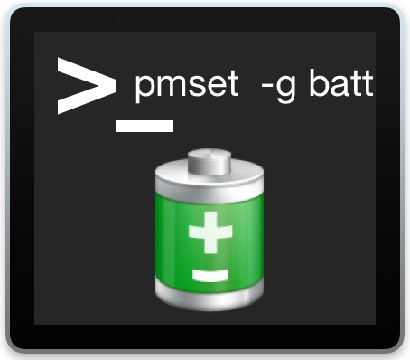

<p align="center">

</p>

<div align="center">

[](https://github.com/maoguy/pmsetter/stargazers)
[](https://github.com/maoguy/pmsetter/network)
[](https://github.com/maoguy/pmsetter/blob/master/LICENSE)
[](https://github.com/maoguy/pmsetter/releases)
[](https://github.com/RichardLitt/standard-readme)
</div>

<div align="center">
  pmsetter - 一个用于对Mac电脑进行电源策略控制的APP
</div>

## 简介
&emsp;&emsp;pmsetter 是一个基于pmset命令行工具封装的图形化应用，可用于对Mac电脑进行电源策略控制。

1. 源码仓库：[Github](https://github.com/maoguy/pmsetter)
2. 下载地址：[Github Releases](https://github.com/maoguy/pmsetter/releases)

## 截图


# pmsetter
an Electron app with React, TypeScript, and Vite.

# Install

Install the dependencies using `npm` (adjust for your chosen package manager):

```sh
$ npm install
```

# Run

## Development

Includes HMR support for the frontend (React) code, and auto-reload for the backend (Electron/Node) code:

```sh
$ npm run dev
```

## Preview

Preview the result of building the app:

```sh
$ npm run preview
```

## Build

Build the Electron app for your OS:

```sh
$ npm run build
```
